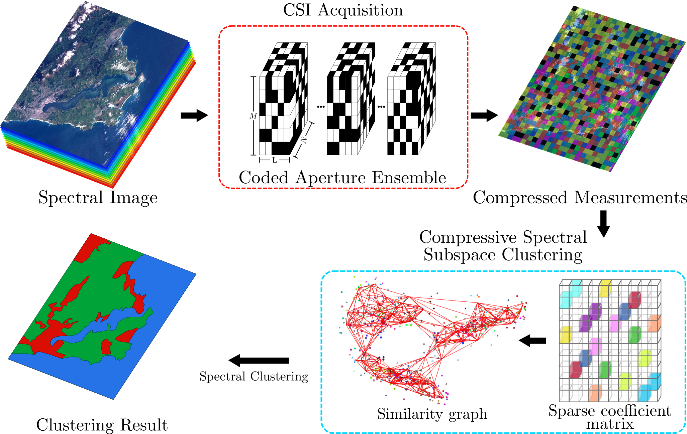
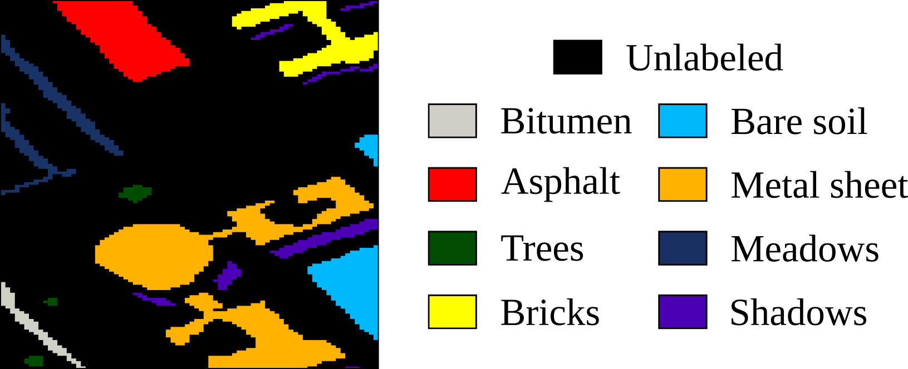

# CODED APERTURE DESIGN FOR COMPRESSIVE SPECTRAL SUBSPACE CLUSTERING

## Abstract
Compressive spectral imaging (CSI) acquires compressed observations of a spectral scene by applying different coding patterns at each spatial location and then performing a spectral-wise integration. Relying on compressive sensing, spectral image reconstruction is achieved by using nonlinear and relatively expensive optimization-based algorithms. In the CSI literature, several works have focused on improving reconstructions quality by properly designing the set of coding patterns. However, signal recovery is not actually necessary in many signal processing applications. For instance, assuming that compressed measurements with similar characteristics lie on the same subspace, unsupervised methods like subspace clustering can be used to separate them into the same cluster. Since the structure of compressed measurements is defined by the applied codification, it is possible to improve clustering performance. This work proposes to design an set of coding patterns such that inter-class and intra-class data structure is preserved after the CSI acquisition in order to improve clustering results directly on the compressed domain. To validate the coding pattern design, an algorithm based on sparse subspace clustering (SSC) is proposed
to perform clustering on the compressed measurements. The proposed algorithm adds a 3D spatial regularizer to the SSC problem exploiting the spatial correlation of spectral images. In general, an overall accuracy up to 83.81% is obtained, when noisy measurements are assumed. In addition, a difference of at most 4% in terms of overall accuracy was observed when comparing the clustering results obtained by the full 3D data with those achieved using CSI measurements acquired with the proposed coding pattern design.

## Workflow
The following picture depicts the CSI subspace clustering workflow. Spectral signatures of the scene are encoded by the coded aperture ensemble before the spectral-wise integration. Proper coded aperture design to preserve spectral similarities, allows to perform clustering directly on the compressed measurements.



This repository contains the MatLab codes of this paper. The complete paper can be downloaded from my personal [webpage](https://carlosh93.github.io/).

## Getting Started

The Code was developed in MatLab using GPU, however the matlab function to run on CPU is also provided.

### Prerequisites

- MatLab 2016 or greater
- Hyperspectral image to cluster

### Download Hyperspectral Images

The Databases used in this project were downloaded from http://www.ehu.eus/ccwintco/index.php/Hyperspectral_Remote_Sensing_Scenes

However, we provide a subset of Pavia University dataset in this repository with the following groundtruth


## Running the code
1. Clone this repository
2. Download a database from Computational Inteligence Group [webpage](http://www.ehu.eus/ccwintco/index.php/Hyperspectral_Remote_Sensing_Scenes). Or use the provided subset of Pavia University.
3. Select to run on CPU or GPU (line 16 of main.m). Default is "GPU Single"
```
%% Choose Architecture
% 1:    GPU Single
% 2:    GPU Double
% 3:    CPU

arch = 1;
```
4. Run main.m


## How to cite

If this code is useful for your and you use it in an academic work, please consider citing this paper as

```bib
@article{hinojosa2018coded,
  title={Coded aperture design for compressive spectral subspace clustering},
  author={Hinojosa, Carlos and Bacca, Jorge and Arguello, Henry},
  journal={IEEE Journal of Selected Topics in Signal Processing},
  volume={12},
  number={6},
  pages={1589-1600},
  year={2018},
  publisher={IEEE},
  keywords={compressed sensing;correlation methods;data structures;image coding;image reconstruction;optimisation;pattern clustering;unsupervised learning;compressed domain;coding pattern design;sparse subspace clustering;compressed measurements;spectral images;clustering results;CSI measurements;compressive spectral imaging;compressed observations;spectral scene;spatial location;spectral-wise integration;compressive sensing;spectral image reconstruction;signal processing applications;clustering performance;CSI acquisition;coded aperture design;coding patterns;compressive spectral subspace clustering;nonlinear optimization-based algorithm;relatively expensive optimization-based algorithm;intraclass data structure;interclass data structure;three-dimensional spatial regularizer;3D spatial regularizer;SSC problem;spatial correlation;Apertures;Image coding;Three-dimensional displays;Clustering algorithms;Imaging;Compressive spectral imaging;coded aperture design;spectral subspace clustering}, 
doi={10.1109/JSTSP.2018.2878293}, 
ISSN={1932-4553}, 
month={Dec},
}
```
## Authors

* **Carlos Hinojosa** - [GitHub](https://github.com/carlosh93) - [WebPage](https://carlosh93.github.io/) - [Scholar](https://scholar.google.com/citations?hl=es&user=KP02_jwAAAAJ)
* **Jorge Bacca** - [GitHub](https://github.com/jorgebaccauis)  - [Scholar](https://scholar.google.com/citations?user=I5f1HjEAAAAJ&hl=es)

